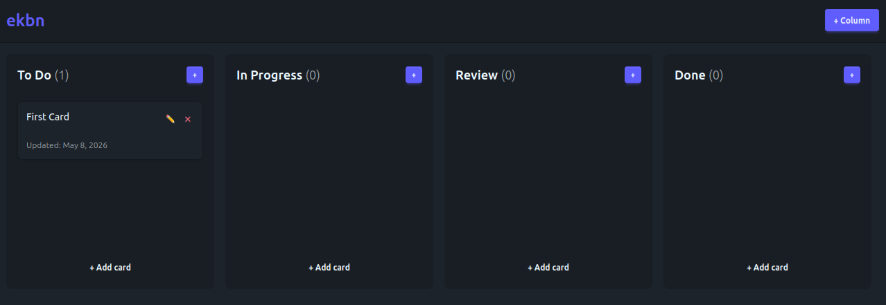

# ekbn - Embedded Kanban



A lightweight local tool for project management.
You can edit the cards with your favorite text editor or open the web application.
It comes with an agentic mode for planning and implementing.

## Architecture

Each folder represents a column.
1 task = 1 Markdown file in a column.
1 server app reading and writing files, written in Go.
1 front-end app, written in TS with DaisyUI.

It's all bundled in the binary so you don't have anything to install or build.
You can find the binaries (Linux, Windows, macOS) in the Actions tab, in the merge PR workflows.

Requirement: 
- File watcher: check https://github.com/fsnotify/fsnotify for platform support.

## Run

The binary comes with a `serve` command. Careful, if no port is specified (as an environment variable or a config) then a random port is picked: it's convenient but when running the app from a GUI, the process will remain active unless you explicitely kill it.

## Caveats

If running ekbn inside a Docker Container, the agent needs to access your dev tools. I need to add a way to properly sandbox but provide the agent with some capabilities (a proxy? a proxy MCP?).

## Server & UI Capabilities

- Create card
- Update card
- Move card
- Delete card
- Create column
- Move column

There's a file watcher that notifies the front-end whenever a card file is created, modified, deleted or moved. The event is pushed via WebSocket in order to sync the state.

## MCP Support

Your favorite agent is able to interact with this app via MCP. To run the app with MCP support, use the `mcp` command.

## Customization

You can create an `ekbn.config.yml` (or `ekbn.config.yaml`) file next to the binary and set the following properties:

```yml
theme: dark
folder-name: columns
port: 8080
```

The theme can be configured via a `custom.css` file. ekbn is using DaisyUI under the hood so defining themes is as simple as providing custom variables.
See the `custom.css` file from the repo.
